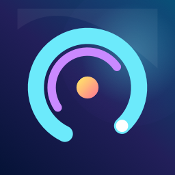
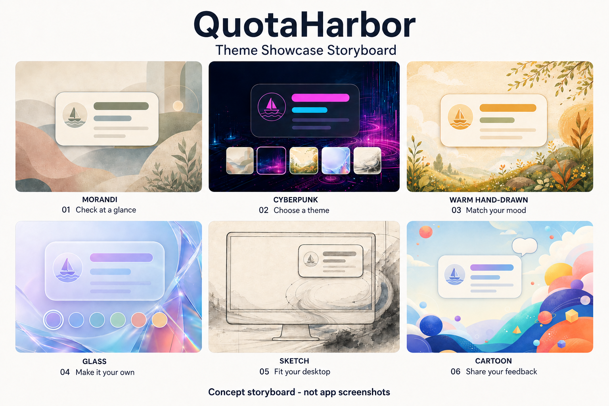

# QuotaHarbor

[English](README.en.md) ｜ [繁體中文](README.md)

> 非官方社群專案，與 OpenAI、Anthropic 或 Apple 無隸屬、合作、認證或背書關係。產品名稱與商標均屬各自權利人所有。

QuotaHarbor 是一款簡單、方便的額度檢視工具，希望讓你在日常使用時，能輕鬆掌握需要的資訊。作為非官方作品，我們將重點放在清楚易讀、操作直覺，以及能融入桌面風格的使用體驗。

我們提供多種內建主題，讓你隨著心情與桌面風格自由切換；也支援自訂外觀，打造更符合個人喜好的樣貌。希望它不只是實用的小工具，也能為你的桌面增添一點個人特色。

這是我們的第一款作品，還有許多值得打磨的地方。歡迎分享使用心得、提出建議，或告訴我們遇到的問題，幫助它一步步變得更好。謝謝你願意試用，也希望你會喜歡！



## 六款內建主題 / Six built-in themes

以下為專案現有的主題背景素材，不是程式操作截圖。選一款喜歡的風格，讓小工具更貼近你的桌面。

These are the project's existing theme background artworks, not app screenshots. Pick a look that feels at home on your desktop.

| 莫蘭迪 / Morandi | 賽博龐克 / Cyberpunk | 溫暖手繪風 / Warm Hand-drawn |
| --- | --- | --- |
|  |  |  |

| 玻璃 / Glass | 素描 / Sketch | 卡通插畫 / Cartoon Illustration |
| --- | --- | --- |
|  |  |  |

## 主題展示分鏡 / Theme showcase storyboard

使用上述六款主題製作的概念展示分鏡，呈現「查看資訊 → 挑選主題 → 配合心情 → 自訂風格 → 融入桌面 → 分享回饋」的介紹順序。圖中的卡片、色票與桌面輪廓僅供示意，不代表實際介面、操作步驟或真實額度資料。

A concept storyboard built around the six themes above, introducing the experience of checking information, choosing a theme, matching your mood, personalizing the look, fitting it into your desktop, and sharing feedback. The cards, swatches, and desktop outlines are illustrative—not actual app screens, instructions, or real quota data.



| 分鏡 / Frame | 展示重點 / Scene |
| --- | --- |
| 01 · Morandi | 一眼查看資訊 / Check at a glance |
| 02 · Cyberpunk | 挑選主題 / Choose a theme |
| 03 · Warm Hand-drawn | 配合心情 / Match your mood |
| 04 · Glass | 自訂個人風格 / Make it your own |
| 05 · Sketch | 融入桌面 / Fit your desktop |
| 06 · Cartoon | 分享使用回饋 / Share your feedback |

素材說明：六款主題背景為專案既有的 AI 生成素材；「手繪風」與「素描」描述視覺風格，不代表人工繪製。展示分鏡以這些素材為參考，使用 AI 生成，不是實際程式截圖。

Artwork note: The six theme backgrounds are existing AI-generated project assets. “Hand-drawn” and “Sketch” describe their visual styles, not how they were made. The storyboard is AI-generated using those artworks as references; it is not a set of app screenshots.

## 功能

QuotaHarbor 是原生 macOS 選單列小工具。Codex 固定啟用；Claude Code 可由使用者選擇是否顯示。選單列與可保留、可拖曳的浮動卡片只呈現本機官方程式實際提供的連線與額度資料，不代替使用者登入、不修改使用量，也不把「沒有資料」顯示成 `0`。啟用 Claude 後，使用者可另外確認安裝本機 `statusLine` relay；隱藏 Claude 不會自動修改或移除 relay。

- 設定與首次導覽固定啟用 Codex，並提供 Claude Code 顯示開關；Google Antigravity 與 Kimi Code 不在可選清單。Codex 使用專屬的自動／手動額度窗口控制。
- Schema v3 仍可讀取既有設定；載入或寫入時保證 Codex 存在，保留使用者選擇的 Claude，並移除 Google／Kimi 等不支援的平台與偏好。
- 一個常駐的 macOS 選單列項目，提供「自動」、「主要平台」與「完整」三種顯示方式。
- 按住 Command 可拖曳選單列項目，位置由 macOS 的 autosave 機制保存；App 無法強制固定在最左邊。「完整」內容過寬時，macOS 可能因選單列剩餘空間不足而隱藏項目，這時可改用「自動」或「主要平台」。
- 可保留、可拖曳的浮動卡片；只選 Codex 時維持單欄，啟用 Claude 後以橫向雙欄呈現。關閉卡片後 App 仍留在選單列，重新點擊即可叫回。
- 「平衡」在一般字級與可用空間下會一次呈現內容，不需捲動；「完整」、輔助使用大字級或受限螢幕空間仍保留安全捲動。
- 預設跟隨目前 Space，也可由設定改成所有 Spaces。
- 剩餘／已使用百分比切換、重置時間、資料新鮮度、手動更新，以及清楚標示無法取得或資料過期的狀態。
- 六種內建高畫質主題：莫蘭迪、賽博龐克、暖色手繪、玻璃感、素描、卡通插畫。
- 完整自訂主題編輯器，含匯入驗證、本機重新編碼與安全匯出。
- 跟隨系統或手動選擇繁體中文、簡體中文、英文、日文、韓文、西班牙文、法文、德文。
- 顯示上游實際回傳的 UTC 今日 token 總量與本月局部加總；若上游沒有 input／output split，程式不會自行推估。
- 首次導覽預先勾選「登入時啟動」，只有使用者完成確認後才向 macOS 登錄，之後可隨時關閉。

## 平台能力

| 來源 | App 會顯示的內容 | 不會做的事 |
| --- | --- | --- |
| Codex | 官方 App Server 的登入狀態、額度窗口、重置時間與 token activity | 不讀瀏覽器 cookie、ChatGPT 對話或私人 API |
| Claude Code | 本機 `claude auth status` 的連線狀態，以及 `statusLine` relay 快取中的五小時／七天額度與重置時間 | 不讀 Claude 對話、prompt、transcript、瀏覽器 cookie 或私人 API |

Claude 顯示開關與 relay 管理是兩個不同操作：取消顯示只隱藏卡片，不修改 `~/.claude`；安裝或移除 relay 都需要另外確認。若既有 `statusLine`、檔案指紋或復原資料無法安全處理，App 會停止並顯示手動復原指引。資料流見 [Architecture](docs/ARCHITECTURE.md)。

## 系統需求

- Apple Silicon Mac（`arm64`）
- macOS 14 或以上
- ChatGPT 安裝於 `/Applications/ChatGPT.app`，且 Codex 已可正常登入與使用
- 若要顯示 Claude：已安裝並登入支援的 Claude Code CLI

Windows、Intel Mac、Linux 與 Mac App Store 版不在首版範圍。

## 安裝、更新、移除與發佈邊界

來源碼可依 MIT License 使用、修改與再散布。公開來源包與公開二進位檔是兩條不同發佈軌：

- `scripts/create_source_archive.sh` 產生 `QuotaHarbor-<version>-source.zip`、內容／type／mode manifests、checksum 與 machine-readable receipt；只封裝可公開的來源、測試、文件與素材，不包含 build、dist、安裝收據、agent 紀錄或本機路徑。封裝器會先建立 immutable snapshot，再在該 snapshot 的獨立副本上執行完整 repository/security gate，確保 gate 與 ZIP 綁定同一內容。乾淨的單一 root public lineage 必須改用 `--public-lineage`，才會另外驗證全部可達 Git 歷史。
- `scripts/create_source_candidate_receipt.sh` 只接受乾淨 Git commit；它會由該 SHA 建立不含原 worktree ignored metadata 或 index flags 的獨立 Git snapshot，並讓 repository gate、packaging self-test、三輪 structured noninteractive tests 與 source archive 全部只對這一份 snapshot 執行。使用 `--public-lineage` 時，它還會以 snapshot 內已提交的 verifier 在前後兩次直接檢查原始 repo 與 locked SHA，拒絕額外 branch／tag、detached 或非 `main` HEAD、shallow history 與 unreachable objects；不會用淨化後的 synthetic repo 冒充原始歷史。它也會獨立重讀每輪 test tree、summary 與 exact skip set，最後產生單一 `source-candidate-receipt.json`。這份候選資料包含本機 log 與 `.xcresult`，只能作為私有驗證證據，不能直接公開；其中 hosted CI 會保持 `pending`，因此也不等於 public source beta 已完成。
- `scripts/build_local_release.sh` 會建立 ad-hoc 簽署的本機測試版；這種 ZIP 只適合自己的 Mac，不應當成公開下載成品。
- 對外提供 `.app` 前，仍必須使用已凍結的永久 bundle identifier，完成 Developer ID Application 簽署、Apple notarization 與 stapling，並通過 Gatekeeper。詳見 [發佈手冊](docs/release/RELEASING.md)。

發佈身分已凍結：公開產品名稱是 **QuotaHarbor**，publisher namespace 是 `justinrow-art`，canonical repository URL 是 <https://github.com/justinrow-art/quota-harbor>，永久 App bundle identifier 是 `com.justinrow.quotaharbor`。既有 `justinrow-art/codex-quota-monitor` 僅保留為 private archive，不屬於 QuotaHarbor 的 canonical public lineage。

Canonical repository 的 commit、tag 與 source release，和 binary distribution 是分開的發佈軌。任何二進位發佈主張，都必須有綁定該精確 binary artifact 的驗證收據，涵蓋 Developer ID 簽署、notarization、stapling 與 Gatekeeper 驗證。

相容性界線：這一階段只凍結公開身分。Xcode project／target／module、`.app` 與 executable 名稱仍是 `CodexQuotaMonitor`，本機 ad-hoc binary 也沿用該名稱；資料仍存放於 `~/Library/Application Support/CodexQuotaMonitor/`。這些是暫時保留的內部／相容性名稱，不是公開產品名稱，本次也沒有設計或執行資料遷移。

正式版本的安裝、既有安裝更新、回滾與安全移除步驟，請直接依照[安裝、更新與移除指南](docs/release/INSTALLATION.md)；常見問題見 [Troubleshooting](docs/TROUBLESHOOTING.md)。

## 從來源建置

需要支援 Swift 6 的 Xcode。專案沒有 Swift Package 或第三方 runtime framework。

```bash
bash scripts/verify_repository.sh

xcodebuild test \
  -project CodexQuotaMonitor.xcodeproj \
  -scheme CodexQuotaMonitorCI \
  -destination 'platform=macOS,arch=arm64' \
  -parallel-testing-enabled NO \
  -only-testing:CodexQuotaMonitorTests

bash scripts/build_local_release.sh
```

GUI tests 只能在隔離的 Aqua session 執行。一般已登入的桌面，以及該桌面上的普通小視窗，都不是隔離環境，禁止在那裡執行 GUI tests。隔離的 macOS VM 與專用測試 Mac 路線目前仍為 `PROBE_PENDING`；Xcode Cloud 環境變數可由本機偽造，因此在取得不可偽造的外部證明前明確不受支援。沒有隔離證據時必須停止，不得把手動 GUI 驗收推給使用者。詳見[隔離 UI 測試安全界線](docs/testing/isolated-ui-testing.md)。

## 資料與安全邊界

```text
QuotaHarbor
  ├─ Codex：驗證 ChatGPT 內的 Codex executable
  │   └─ 固定 argv；5-method RPC allowlist：
  │       initialize / initialized / account/read /
  │       account/rateLimits/read / account/usage/read
  └─ Claude Code（可選）
      ├─ 固定 `claude auth status`；受限路徑、環境、輸出與逾時
      └─ 經使用者再次確認的 statusLine relay
          └─ 只保存五小時／七天額度、重置時間與接收時間
```

本 App 本身不建立 HTTP client，也不提供登入、登出、購買、消耗 credit、瀏覽器／cookie 擷取，亦不以私人端點作為備援。外部 Codex 程式依使用者既有 ChatGPT 帳號狀態運作。

Claude relay 快取只保存五小時／七天的使用百分比、重置時間與接收時間；它不保存原始 payload、email、cwd、transcript path、prompt 或對話內容。安裝前建立的復原備份可能包含完整的 Claude `settings.json`，因此也會包含使用者自行放在其中的秘密。App 只在指紋安全時安裝或移除；無法安全自動處理時會停止並顯示指引：保留復原檔案與備份、不公開備份內容、不自動覆寫 Claude 設定，並依 [Troubleshooting](docs/TROUBLESHOOTING.md) 的手動復原流程處理。復原目錄使用 `0700`、檔案使用 `0600`。詳細揭露見 [Privacy](docs/release/PRIVACY.md)、[Security](docs/release/SECURITY.md)、[Codex executable 威脅模型](docs/security/executable-trust-threat-model.md) 與 [Claude relay 威脅模型](docs/security/claude-integration-threat-model.md)。

## 官方資料來源

- OpenAI：[Using Codex with your ChatGPT plan](https://help.openai.com/en/articles/11369540-using-codex-with-your-chatgpt-plan)、[Codex rate card](https://help.openai.com/en/articles/20001106)
- Anthropic：[Status line](https://code.claude.com/docs/en/statusline)

## 參與專案

請先閱讀 [CONTRIBUTING.md](CONTRIBUTING.md)、[CODE_OF_CONDUCT.md](CODE_OF_CONDUCT.md) 與 [SECURITY.md](SECURITY.md)。安全問題請勿先開公開 issue。

## 授權與品牌

程式碼與專案自有素材依 [MIT License](LICENSE) 提供；外部服務、商標與 AI 素材揭露見 [NOTICE.md](NOTICE.md) 與 [Third-party notices](docs/release/THIRD_PARTY_NOTICES.md)。相容性名稱只用於描述本 App 所連接的外部軟體，不代表官方產品或背書。
